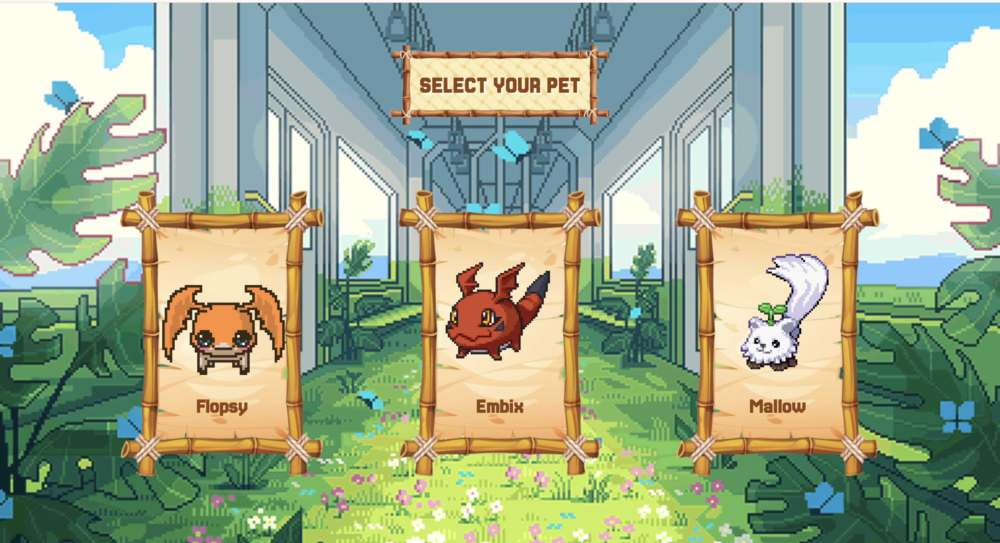
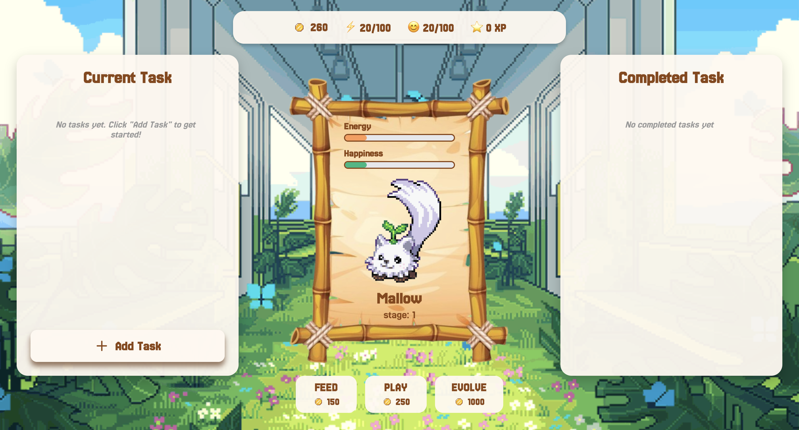

# 🌸 Finito

**A todo app with a virtual pet companion.** Complete tasks, earn coins, and watch your pet grow.

---

## 🐾 What is Finito?

Finito is a productivity app that makes task management more fun by pairing it with a virtual pet. Every task you finish rewards you with coins and XP — which you use to keep your pet happy, fed, and eventually evolve it into a stronger form.

The name "Finito" means *finished* in Italian — because getting things done should feel satisfying. ✨

---

## 📸 Screenshots

| 🐾 Pet Selection | 🏠 Main App |
|-----------------|------------|
|  |  |

---

## 🌟 Features

### 🐣 Your Pet
- Pick one of **3 unique pets** at the start: **Flopsy**, **Embix**, or **Mallow**
- Each pet has **3 evolution stages** — they visually change as they grow
- Your pet has two stats that slowly decay over time:
  - ⚡ **Energy** — decreases gradually, restored by feeding
  - 😊 **Happiness** — decreases gradually, restored by playing

### ✅ Tasks
- Add tasks with a **title**, **priority level**, and **estimated duration**
- Optionally set a **deadline** 📅
- Task rewards scale with difficulty:

| ⏱️ Duration | 🪙 Base Coins |
|-------------|--------------|
| Quick       | 50           |
| Short       | 100          |
| Medium      | 200          |
| Long        | 300          |

- 🔴 High priority tasks give **1.5x** coins, 🟡 medium give **1.2x**
- Every task also earns ⭐ **XP** (coins ÷ 5)
- Completed tasks are tracked in a history panel 📋

### 🪙 Coins & Actions
Spend coins to interact with your pet:

| Action   | Cost     | Effect                         |
|----------|----------|--------------------------------|
| 🍖 Feed  | 150 🪙   | +30 ⚡ Energy                  |
| 🎮 Play  | 250 🪙   | +35 😊 Happiness               |
| ✨ Evolve | 1000 🪙  | Evolves pet to the next stage  |

### 🔮 Evolution
Your pet evolves based on XP earned:

| Stage       | ⭐ XP Required |
|-------------|---------------|
| 🐣 Stage 1  | Starting       |
| 🐥 Stage 2  | 1,000 XP      |
| 🐦 Stage 3  | 3,000 XP      |

---

## 🛠️ Tech Stack

- ⚛️ **React 19** — UI framework
- ⚡ **Vite** — build tool and dev server
- 🔀 **React Router DOM** — page navigation
- 🎞️ **Framer Motion** — animations and transitions
- 🎨 **Lucide React** — icons

---

## 🚀 Getting Started

**Prerequisites:** Node.js installed on your machine.

```bash
# 1. Clone the repository
git clone https://github.com/haine88/finito-app.git
cd finito-app

# 2. Install dependencies
npm install

# 3. Start the dev server
npm run dev
```

Then open [http://localhost:5173](http://localhost:5173) in your browser. 🌐

---

## 🎮 How to Play

1. 🌸 **Welcome screen** — click **Begin** to start
2. 🐾 **Pick your pet** — choose Flopsy, Embix, or Mallow
3. ➕ **Add tasks** — hit the **+** button, fill in the details, and submit
4. ✅ **Complete tasks** — click the checkmark (✓) to finish a task and collect your reward
5. 💛 **Care for your pet** — use your coins to Feed and Play with it so its stats don't drop to zero
6. ✨ **Evolve** — earn enough XP and coins to unlock your pet's next stage

---

## 📁 Project Structure

```
src/
├── pages/
│   ├── WelcomePage.jsx       # 🌸 Landing / intro screen
│   ├── CharacterPage.jsx     # 🐾 Pet selection screen
│   └── HomePage.jsx          # 🏠 Main app (tasks + pet)
├── components/
│   ├── TaskCard.jsx          # 📋 Individual task with reward info
│   ├── TaskForm.jsx          # ✏️  Form to add a new task
│   └── PetDisplay.jsx        # 🐣 Pet sprite + energy/happiness bars
├── styles/                   # 🎨 CSS for each page and component
└── assets/images/            # 🖼️  Pet GIFs and UI images
```
